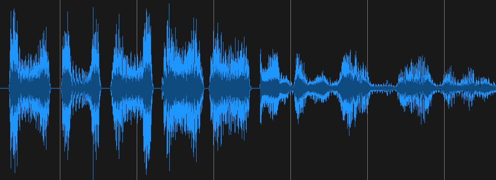
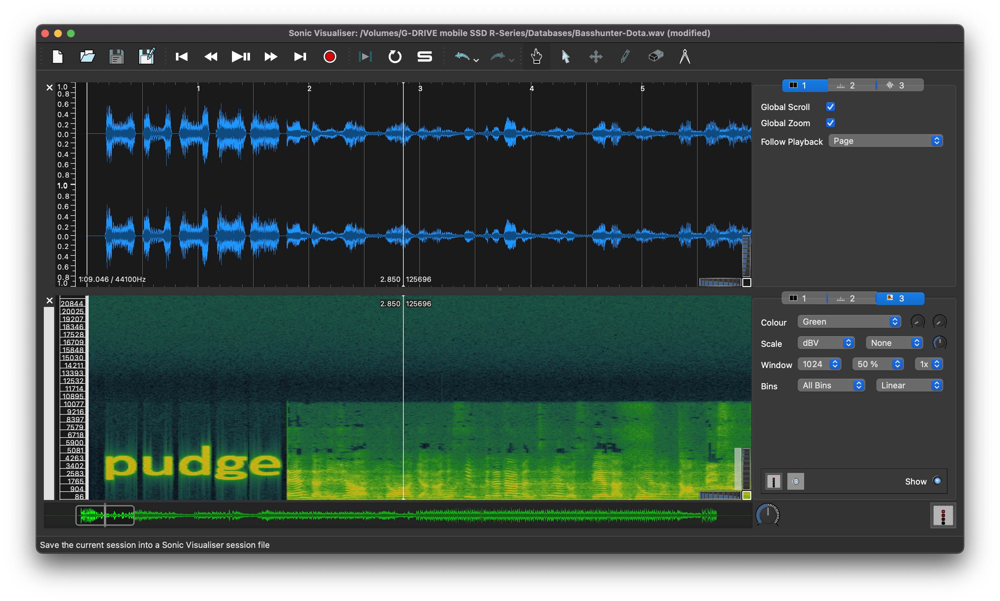
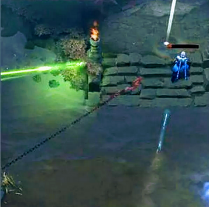

# DotA

For this challenge, we are presented only with a .wav file of the *2006 electro smash-hit* **"DotA"** by *Sweedish heart-thob sensation*, **BASSHUNTER**.


After listening to the audio file (and vibing heavily), we could notice a strange chirping sound at the beginning and end of the clipping.



The waveform indicates a clear distinction between multiple *chirping* sounds before the banger kicks in. In order to investigate the strange sounds further, we can analyse a spectogram of the audio.



The audio file has a secret word embedded in the audio. As this word isn't the flag, we can assume that there is more work to do. An attempt to use the secret as a password for a steghide extraction proves successful.
```
$ steghide extract -sf Basshunter-Dota.wav -xf dota.out
> Enter passphrase: pudge
wrote extracted data to "dota.out".

$ file dota.out 
dota.out: PNG image data, 357 x 354, 8-bit/color RGB, non-interlaced
```
The audio file was in fact hiding more data than initially anticipated. Below is the image that was embedded in the audio file.



After doing some light research, I found that the image is linked to the origin of an obscure *gaming meme* wherein *Pudge* is a character who is described online as a "*n00b trap*" due to the massive hit-or-miss factor he represents when using his "*hook attack*". Some claim he is simply "*overpowered*" and "*annoying to play against*". Either way, the controversy surrounding this character is undeniable, and I'm glad I have no clue what any of this means.  

The next step is to check the exif data of the image.
```
$ exiftool dota.png
ExifTool Version Number         : 11.65
File Name                       : dota.png
Directory                       : .
File Size                       : 166 kB
File Modification Date/Time     : 2020:11:22 21:08:58+11:00
File Access Date/Time           : 2020:11:22 21:13:17+11:00
File Inode Change Date/Time     : 2020:11:22 21:08:58+11:00
File Permissions                : rw-r--r--
File Type                       : PNG
File Type Extension             : png
MIME Type                       : image/png
Image Width                     : 357
Image Height                    : 354
Bit Depth                       : 8
Color Type                      : RGB
Compression                     : Deflate/Inflate
Filter                          : Adaptive
Interlace                       : Noninterlaced
Gamma                           : 2.2
White Point X                   : 0.3127
White Point Y                   : 0.329
Red X                           : 0.64
Red Y                           : 0.33
Green X                         : 0.3
Green Y                         : 0.6
Blue X                          : 0.15
Blue Y                          : 0.06
Background Color                : 255 255 255
Pixels Per Unit X               : 96
Pixels Per Unit Y               : 96
Pixel Units                     : Unknown
Modify Date                     : 2020:10:01 05:30:38
Datecreate                      : 2020-10-01T05:29:26+00:00
Datemodify                      : 2020-10-01T05:28:03+00:00
Comment                         : ZmxhZ3t0aGlzZ2FtZXN1Y2tzeW91cnNvdWx9
Image Size                      : 357x354
Megapixels                      : 0.126

```
We notice what seems to be a Base64 string included as a comment.

```
$ echo ZmxhZ3t0aGlzZ2FtZXN1Y2tzeW91cnNvdWx9 | base64 -d
flag{thisgamesucksyoursoul}
```
Thank you to the creator of this challenge and its *based* content.

## Resources
https://www.reddit.com/r/DotA2/comments/bs1kan/it_was_in_this_moment_he_knew/