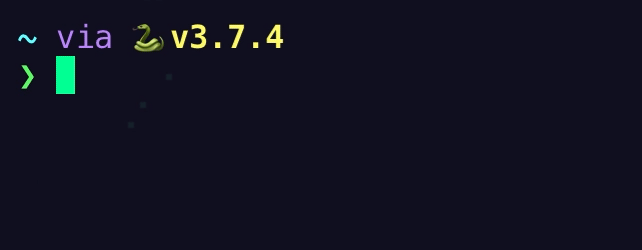

# Tiny Secrets

For this challenge, we are given a server address and a port number, along with the source code that the server is running. I've ammended the below slightly to run on my own system.

## Source Code
```python
import gzip
import os
import socketserver
import re

# pip install "cryptography"
from cryptography.hazmat.primitives.ciphers import Cipher, algorithms
from cryptography.hazmat.backends import default_backend

flag = os.environ.get("FLAG", "flag{not_the_flag}")

if not re.match(r"flag{[a-z_]+}", flag):
    raise ValueError("Invalid flag format")

flag = flag.encode()  # Convert to bytes
nonce = os.urandom(16)
key = os.urandom(32)
algorithm = algorithms.ChaCha20(key, nonce)
cipher = Cipher(algorithm, mode=None, backend=default_backend())
encryptor = cipher.encryptor()


def compress(src: bytes) -> bytes:
    return gzip.compress(src)


def encrypt(src: bytes) -> bytes:
    return encryptor.update(src)


class FlagServer(socketserver.StreamRequestHandler):
    def handle(self):
        data = self.rfile.readline().strip()
        if data == flag:
            self.wfile.write(flag + b"\n")
            self.finish()
            return

        resp = flag + data
        resp = compress(resp)
        resp = encrypt(resp)
        resp = resp.hex()
        self.wfile.write(resp.encode())
        self.wfile.write(b"\n")
        self.finish()


def main():
    HOST = "0.0.0.0"
    PORT = int(os.environ.get("PORT", "1337"), base=10)

    # Create the server, binding to "0.0.0.0" on port 1337
    server = socketserver.TCPServer((HOST, PORT), FlagServer)
    print(f"Listening on TCP {HOST}:{PORT}", flush=True)
    # Activate the server; this will keep running until you
    # interrupt the program with Ctrl-C
    server.serve_forever()


if __name__ == "__main__":
    main()
```
Simply put, the script starts off by reading the environment variable containing the flag and concatinates it with the data supplied to the server, before compressing and encrypting it, and finally sending it back to the client. Let's see it in action.

```
$ nc 192.168.20.10 1337
> cactus
44f5d4055cff94122d52f6efdfe4c462e0fb89a15ca30911f174f53d3b449155f5fe4bf40f6388dfc511676a8a864ae173287ac4bce08abb
```
We know that "flag" is part of the plain text, so let's give it a squirt.
```
$ nc 192.168.20.10 1337
> flag
9bbeb80d9db609b674b16404dfb21ee7ea4909ab5fe4890a365c6f6f594bf2736ed4b8a7128a6b4d4bbfb63a3188e07cf3ea16186f
```
We find that we receive a shorter length of bytes after sending part of the known plaintext. It seems that the compression of the data is what gives away its secret. We can test this theory further with a BASH one-liner.

```bash
for i in {a..z}; do echo flag{$i | nc 192.168.20.10 1337; done
```
```
5def21706a79690019da61d30981ff88fc166a61fd3135528c5da2d3da21f484ce6a93470dfb0072050a4b743724162989cf07d5f649
...
6b413bf7c109a5b641a1e8ede07b259ed6b9bac91ee02b2eced917c816c98490700a5e02e513f0f996e0933802fc8e2849af853ee6
...
66dee7dc5b40653668cc1eb83dd35da20a2f2c7fbee8c1cc8220f94294669cecfb1058837132b5c3aa48bad4c1e9349650d22a4d39bf
```
The script works as expected, and one line is different in length from all other guesses. The DEFLATE algorithm will reduce bits by reducing redundancy, and by employing an entropy encoding algorthm, which replaces common bytes with shorter codes. Therefore, as the data provided to the server is concatenated with the flag before it is compressed, common characters between the two will produce a shorter length of compressed data before it is encrypted and sent back to the client. From here, we can write another script to append successful guesses to the payload and save us having to look for the right character with the ol' Mark I.

## Give Me the Flag
### In Python
```python
#!/usr/bin/python3

import socket, string

flag = 'flag{'

while flag[-1] != "}":
    
    for i in string.printable[:94]:
        payload = (flag + i).encode()
        s = socket.socket(socket.AF_INET, socket.SOCK_STREAM)
        s.connect(("192.168.20.10", 1337))
        s.send(payload + b'\n')
        r = (s.recv(1028)).decode().strip('\n')
        
        if len(r) <= 106:
            flag += i
            print(flag, end="\r")
```


### In Bash
```bash
#!/bin/bash

flag="flag{"

while [ "$last" != "}" ]; do
    last=$(echo "${flag: -1}")
    for i in {49..127}; do 
            i=$(echo $i | awk '{printf("%c", $0);}')
            l=$(echo $flag$i | nc 192.168.20.10 1337 | wc -c)
            if [ $l -lt 108 ]; then
                    flag="$flag""$i"
                    echo -e '\e[1A\e[K'$flag
            fi
    done
done
```


Thank you to the creator of this challenge.


## Resources
https://media.blackhat.com/us-13/US-13-Prado-SSL-Gone-in-30-seconds-A-BREACH-beyond-CRIME-Slides.pdf
